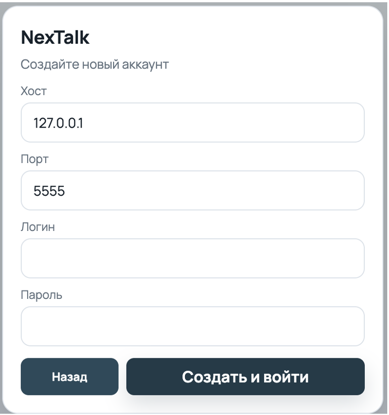
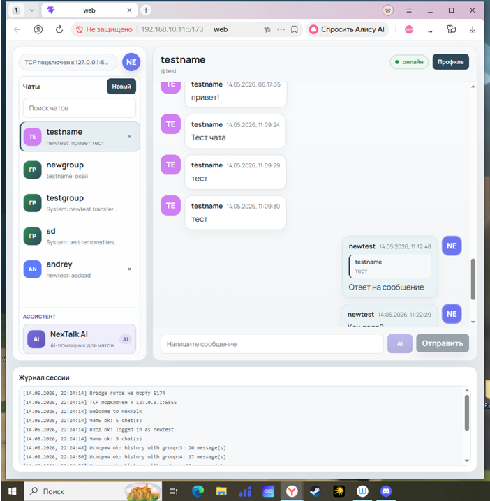
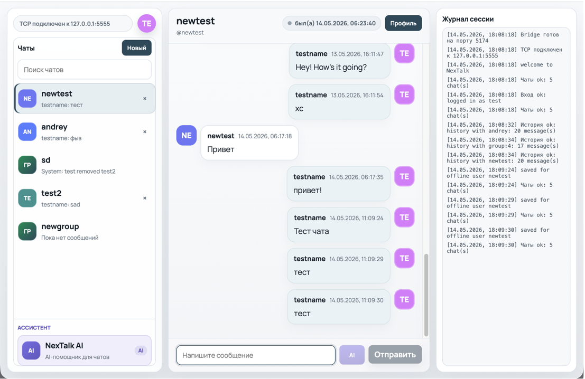
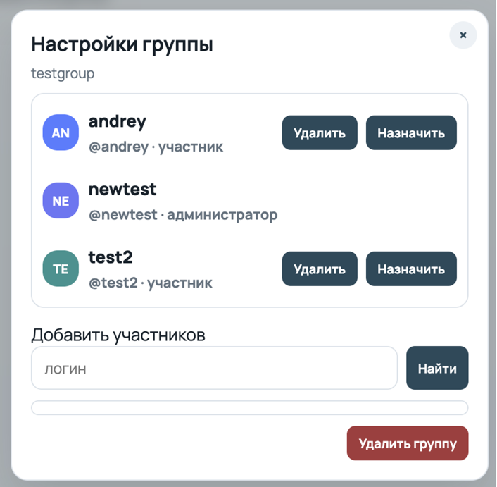
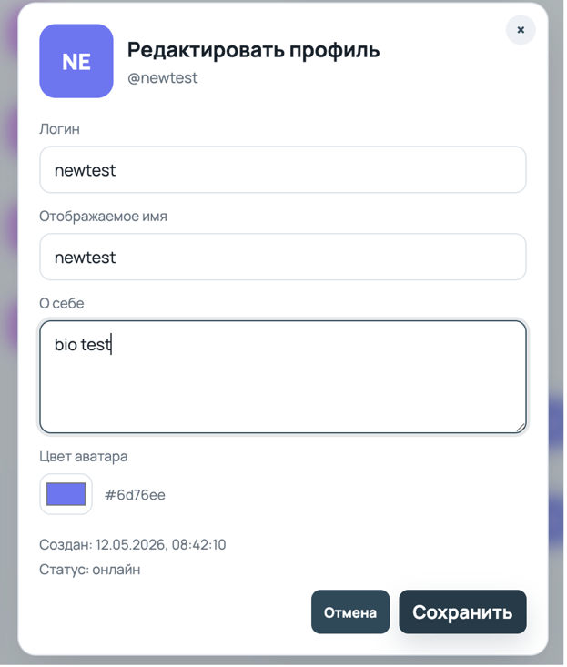
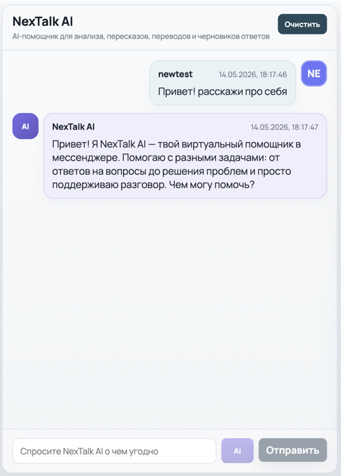
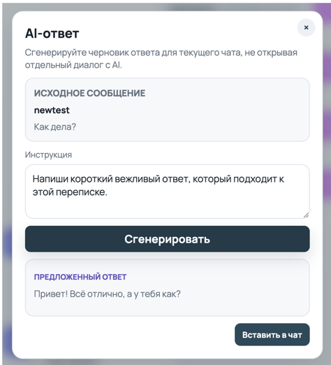
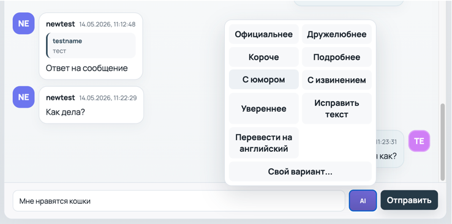

# NexTalk

NexTalk - клиент-серверный мессенджер для UNIX/POSIX с C++-сервером
и веб-фронтендом на Vue + Vite.

Проект сделан как курсовая с фокусом на:

- работу в локальном и сетевом режиме;
- личные сообщения между пользователями;
- постоянное хранение данных и логов;
- расширяемую архитектуру.

## Что реализовано

- TCP сервер на POSIX socket API (`socket`, `bind`, `listen`, `accept`, `select`, `recv`, `send`).
- Многопоточность на сервере: отдельный поток на каждого подключенного web-клиента.
- Регистрация и вход по паролю.
- Пароли хранятся как salt + PBKDF2-HMAC-SHA256 hash.
- Личные чаты (1:1), групповые чаты, создание и удаление диалога.
- Ответы на сообщения, пересылка и мягкое удаление сообщений "у всех".
- Профили пользователей: display name, bio, цветной avatar-circle с инициалами,
  `created_at`, `last_seen`, online/offline статус.
- Отдельный AI-чат `NexTalk AI` через `ai_service` и выбранный AI-провайдер.
- Быстрый `AI Reply` для генерации ответа в текущий чат без сохранения в AI-историю.
- История сообщений (SQLite), в том числе для offline-сценария.
- Непрочитанные сообщения на сервере (`conversation_reads`, `mark_read`).
- Логи сервера с сохранением между сессиями:
  - старт/остановка сервера;
  - подключение/отключение;
  - вход пользователя;
  - обработка и доставка сообщений;
  - ошибки хранилища.
- Веб-клиент (Vue + Vite) через локальный WebSocket bridge и TLS до C++ сервера.

## Структура репозитория

- `server/` - C++ сервер.
- `common/` - общий протокол (парсинг/сериализация).
- `web/` - Vue-фронтенд и bridge (`web/bridge/server.mjs`).
- `docs/` - документация для отчета и сдачи.
- `docs/screenshots/` - скриншоты для вставки в README.
- `ai_service/` - локальный HTTP-сервис для AI-провайдеров (Ollama или GigaChat API).

## Скриншоты

### Регистрация



### Web-режим



### Основной интерфейс



### Групповой чат



### Редактирование профиля



### AI-чат



### Быстрый AI-ответ



### Редактирование AI-ответа



## Требования

- CMake >= 3.20
- C++17 compiler
- SQLite3 dev library
- OpenSSL dev library
- POSIX-система (Linux/macOS/FreeBSD)
- Для web:
  - Node.js 18+
  - npm

## Сборка C++ части

```bash
cmake -S . -B build
cmake --build build
```

## Dev-сертификат для TLS

Перед запуском TLS-сервера нужно один раз сгенерировать локальный сертификат:

```bash
mkdir -p certs
openssl req -x509 -newkey rsa:2048 -keyout certs/server.key -out certs/server.crt -days 365 -nodes
```

Сервер ожидает файлы:

- `certs/server.crt`
- `certs/server.key`

## Запуск сервера

```bash
./build/server/server 5555 0.0.0.0 server.log nextalk.db
```

Аргументы:

`server [port] [bind_address] [log_path] [db_path]`

Примеры:

- локальный режим: `127.0.0.1`
- сетевой режим: `0.0.0.0`

## Запуск web-клиента

1. Запустить сервер C++:

```bash
./build/server/server 5555 127.0.0.1 server.log nextalk.db
```

2. Запустить bridge.

Bridge подключается к C++ серверу через TLS. Для локального учебного режима он
принимает self-signed сертификат сервера.
По умолчанию bridge разрешает подключение только к `127.0.0.1`, `localhost` и
`::1`; для сетевого запуска укажите адрес сервера в `BRIDGE_ALLOWED_HOSTS`.

```bash
cd web
npm run bridge
```

3. Запустить Vite:

```bash
cd web
npm run dev
```

4. Открыть адрес Vite (обычно `http://localhost:5173`).

### Запуск web-клиента по локальной сети

На машине, где будут работать C++ сервер, bridge и Vite, запустите в отдельных
терминалах:

```bash
./build/server/server 5555 0.0.0.0 server.log nextalk.db
```

```bash
cd web
npm run bridge:network
```

```bash
cd web
npm run dev:network
```

Vite выведет сетевой адрес вида `http://192.168.x.x:5173/`. Его можно открыть
с другого устройства в той же сети. В форме подключения можно оставить host
`127.0.0.1`, если bridge и C++ сервер запущены на одной машине.

Пример вывода Vite:

```text
Local:   http://localhost:5173/
Network: http://192.168.10.207:5173/
Network: http://10.20.0.1:5173/
```

`Local` работает только на компьютере, где запущен Vite. Для телефона или
другого ноутбука используйте один из адресов `Network`, который находится в той
же Wi-Fi/LAN сети. Обычно это адрес вида `192.168.x.x`.

Схема сетевого web-режима:

```text
браузер на другом устройстве
  -> Vite:   http://IP_компьютера:5173
  -> bridge: ws://IP_компьютера:5174
  -> server: 127.0.0.1:5555
```

В форме подключения web-клиента:

- если bridge и C++ сервер запущены на одном компьютере, укажите
  `Host: 127.0.0.1`, `Port: 5555`;
- если нужно подключать bridge к серверу по сетевому IP, добавьте этот IP в
  `BRIDGE_ALLOWED_HOSTS` и укажите его в поле `Host`.

Пример bridge для подключения к серверу по IP компьютера:

```bash
cd web
BRIDGE_ALLOWED_HOSTS=127.0.0.1,localhost,::1,192.168.10.207 npm run bridge:network
```

## Запуск AI-чата

Frontend не ходит к AI-провайдеру напрямую. Он отправляет запросы в локальный
`ai_service`, а `ai_service` уже выбирает провайдера через `AI_PROVIDER`.

### Вариант 1. GigaChat API

Этот вариант не требует локально поднимать модель. Нужен ключ авторизации
GigaChat API (`Client ID:Client Secret`, закодированные в Base64).

```bash
cd ai_service
AI_PROVIDER=gigachat \
GIGACHAT_AUTH_KEY=<ваш_ключ_авторизации> \
GIGACHAT_VERIFY_SSL=0 \
python3 app.py

```

По умолчанию `ai_service` запускается на `127.0.0.1:5050`. Порт `5000` не
используется как дефолт, потому что на macOS он часто занят системным сервисом.
Если нужен другой порт, задайте `AI_SERVICE_PORT` и тот же URL во фронтенде через
`VITE_AI_SERVICE_URL`.

`GIGACHAT_AUTH_KEY` можно передать как сам Base64-ключ или как строку с
префиксом `Basic ...`: service нормализует заголовок сам. Токен доступа
получается автоматически при первом AI-запросе. Чтобы проверить авторизацию
сразу, откройте:

```bash
curl 'http://127.0.0.1:5050/health?check=1'
```

При успешной проверке ответ будет содержать `"status": "ok"` и
`"checked": true`.

Ключ GigaChat хранится только на стороне `ai_service` в переменной окружения и
не отправляется в браузер. Все пользователи web-клиента используют этот один
server-side ключ, поэтому лимиты и расходы относятся к аккаунту владельца
`ai_service`.

Если проверка возвращает ошибку `CERTIFICATE_VERIFY_FAILED`, значит локальный
Python не доверяет цепочке сертификатов GigaChat. Для постоянного решения лучше
указать CA bundle через `GIGACHAT_CA_FILE`. Для быстрой локальной проверки можно
временно запустить с `GIGACHAT_VERIFY_SSL=0`.

Полезные переменные:

- `GIGACHAT_MODEL` - модель, по умолчанию `GigaChat`;
- `GIGACHAT_SCOPE` - scope OAuth, по умолчанию `GIGACHAT_API_PERS`;
- `GIGACHAT_BASE_URL` - базовый адрес API, по умолчанию
  `https://gigachat.devices.sberbank.ru/api/v1`;
- `GIGACHAT_AUTH_URL` - endpoint получения токена, по умолчанию
  `https://ngw.devices.sberbank.ru:9443/api/v2/oauth`;
- `GIGACHAT_CA_FILE` - путь к CA bundle, если системное хранилище сертификатов
  не доверяет цепочке GigaChat;
- `GIGACHAT_VERIFY_SSL=0` - только для локальной отладки проблем с сертификатом.

### Вариант 2. Ollama локально

1. Убедиться, что модель скачана:

```bash
ollama pull llama3.2
```

Если локально используется тег модели вроде `llama3.2:3b`, можно не
перекачивать модель, а просто указать этот тег через `OLLAMA_MODEL`.

2. Запустить Ollama:

```bash
ollama serve
```

3. Запустить AI service:

```bash
cd ai_service
python3 app.py
```

AI service по умолчанию принимает browser-запросы только с локальных origin
`localhost`/`127.0.0.1`. Для другого адреса frontend можно задать
`AI_SERVICE_ALLOWED_ORIGINS`.

Если у вас локально модель сохранена как `llama3.2:3b`, запускайте так:

```bash
cd ai_service
OLLAMA_MODEL=llama3.2:3b python3 app.py
```

4. Запустить web:

```bash
cd web
npm run dev
```

### Как пользоваться AI-чатом

- Внизу списка чатов есть отдельный виртуальный чат `NexTalk AI`.
- В него можно просто писать обычные вопросы: например, попросить краткое
  объяснение, перевод или помощь с формулировкой ответа.
- У любого обычного сообщения в контекстном меню есть действие `Ask AI`.
- У любого обычного сообщения в контекстном меню есть и `AI Reply`, и `Ask AI`.
- `AI Reply` открывает отдельное модальное окно, делает одноразовый запрос в
  `ai_service` и дает вставить готовый ответ в input текущего чата без
  автоматической отправки.
- `Ask AI` открывает чат `NexTalk AI`, прикрепляет выбранное сообщение к полю
  ввода, но не отправляет его автоматически.
- Дальше пользователь сам пишет инструкцию, например `Explain this message`,
  `Help me write a reply`, `Summarize it` или `Translate it`, и только потом
  нажимает `Send`.
- Кнопка `Clear` в заголовке AI-чата очищает:
  - сообщения AI-чата на экране;
  - локально сохраненную IndexedDB-историю этого AI-чата;
  - контекст для следующих запросов;
  - pending attachment;
  - текущий input.

### Как устроена замена провайдера

Frontend не ходит к AI-провайдеру напрямую. Схема такая:

`Vue frontend -> ai_service -> provider -> Ollama/GigaChat`

По умолчанию используется `AI_PROVIDER=ollama`. Чтобы не поднимать модель
локально, можно запустить `ai_service` с `AI_PROVIDER=gigachat` и
`GIGACHAT_AUTH_KEY`.

## Куда смотреть в документации

- [Архитектура](docs/architecture.md)
- [Протокол](docs/protocol.md)
- [Дневник разработки](docs/dev_diary.md)

В дневнике разработки отдельно описаны ошибки, которые появлялись во время
доработки интерфейса: дублирование текста в списке чатов, зависание формы входа
после ошибок, неправильная работа локального unread-состояния и временно
убранная плашка непрочитанных сообщений. Туда же добавлены более поздние
исправления: IndexedDB-кэш, мягкое удаление сообщений и серверная ошибка SQL,
из-за которой ломалась загрузка истории, а также конфликт удаления сообщений в
группах при совпадении числовых `message_id` в разных таблицах.
